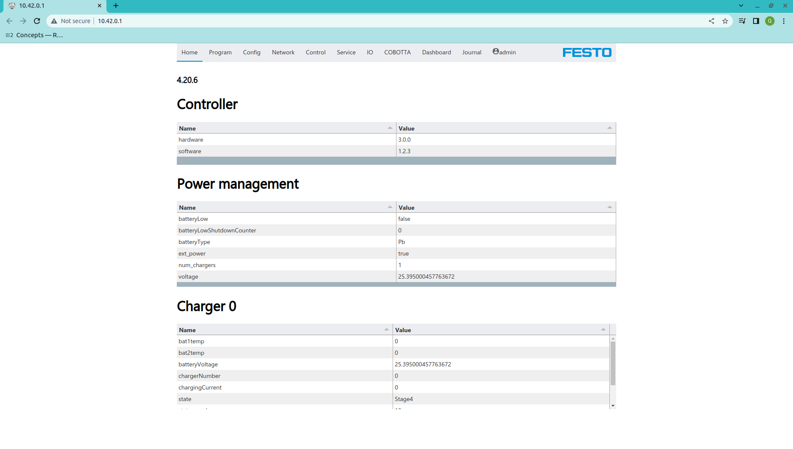
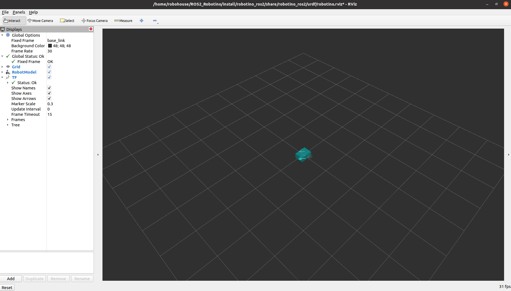
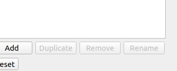
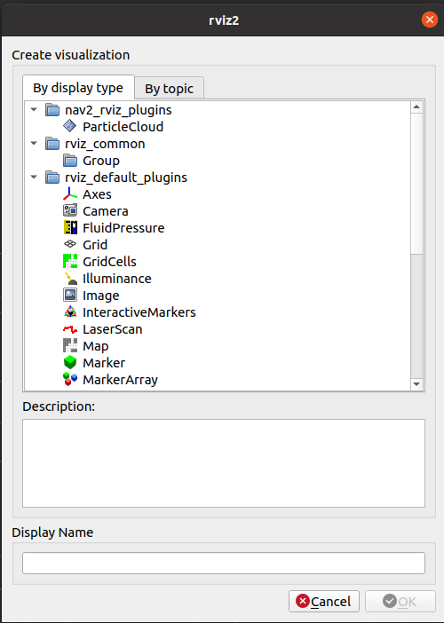
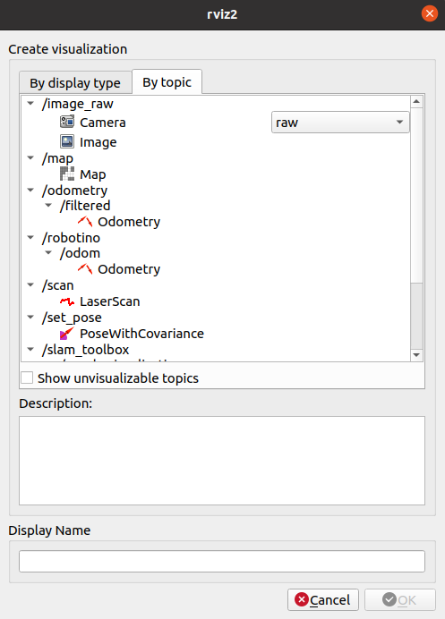
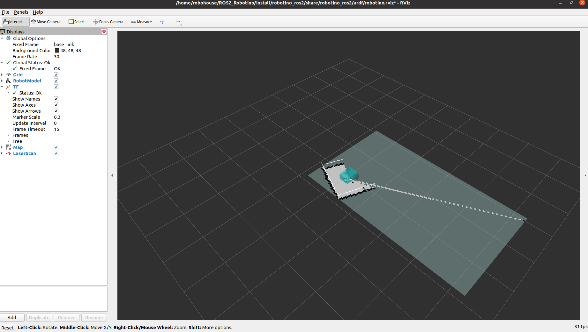

# ROS2_Robotino
ROS2 package for robotino.
Fully redesigned package that adapts to robotino [RestAPI](https://wiki.openrobotino.org/index.php?title=Rest_api).
This tutorail introduces preparation for the ROS2 Robotino Package.

---

## Download the package
Before process this step, please check you have finished the [**Tutorial1**](./tutorial1.md)!

Use the following command to download the package.
```
git clone https://github.com/SkyloveQiu/ROS2_Robotino.git
```

install all relative ROS package by
```
./install.sh
```

install `colcon` build tools by
```
sudo apt install python3-colcon-common-extensions
```

Now you should see the following output in yout terminal

```
Starting >>> robotino_ros2
Starting >>> robotino_ros2_client
Starting >>> robotino_ros2_msg
Finished <<< robotino_ros2 [1.63s]                          
Finished <<< robotino_ros2_client [1.62s]
Finished <<< robotino_ros2_msg [1.99s]                  

Summary: 3 packages finished [2.28s]
```
If everything works fine at this moment, you can start connecting Robotino.

---
## Coneect to the Robotino

Press button on the top of the robotino, and you should be able to see the flashing blue led light. It means the robotino is running.
After few minutes you can find `robotino_ap` access point in your wifi menu.

connect it with password `robotino`

After you connect to the AP, you should be able to visit the following [web](http://10.42.0.1/).

you should be able to see all of the details about the robot.



Please make sure the battery is charged (voltage should be about 25.4V) before you disconnect it from the charger.

If you find the `batteryLow` field is True, please charge it as soon as possible to prevent damage to the hardware.

Due to limited network bandwith and hardware capacity, please don't connect multiple laptops to the robotino!!!!

## Run LiDAR and Camera Node on the robotino

The next step is starting LiDAR and Camera Node on the robotino.

open a new terminal and connect to the robotino by 
```
ssh robotino@10.42.0.1
```
The password is `robotino`

there is one run script avalible in the Home folder. input the following command to start the package

```
./setup.zsh
```

Now you can open another terminal in your computer, and config the network.

use the following command in every new terminal you start in the future to make sure they are connected to each other.

```
export ROS_DOMAIN_ID=1
```

run the following command to make sure the setup is correct
```
ros2 node list
```
The out should at least contain the following two node which are
```
/camera_node
/urg_node
```
If you can see those two nodes, it means your connection is corrected setup.

## Run Robotino Node on your laptop

First step is the link between laser data with the base link.
Open a new terminal and input following commands
```
export ROS_DOMAIN_ID=1
ros2 run tf2_ros static_transform_publisher 0 0 0 0 0 0 "base_link" "laser"
```

The second step is launch Robotino_ros2 package
There is already one run script in the folder.
Use the follow command to start the node:
```
./run.sh
```

you should be able to see the rivz2 prorgam




Click on the left bottom button **ADD** to add map and laserScan node



You will see a menu pops up



click the **By topic** button and you will see the menu



Add both `Map` and `LaserScan` topic to your rviz2.

The map should look like 



At this moment you are ready for creating your own map!

More tutorials and info about slam_toolbox you can find at this [repository](https://github.com/SteveMacenski/slam_toolbox)

Rivz2 tutorial you can find at this [repository](https://github.com/ros2/rviz)

---

## Drive Robotino
Congratulations! You have finished almost everything, but there is still one thing leftover. The robot does not drive.

To drive it around, you can use keyboard to drive. open a new terminal and run the following command
```
export ROS_DOMAIN_ID=1
ros2 run teleop_twist_keyboard teleop_twist_keyboard
```

Follow the instruction on the screen and drive it around!
Be careful! Don't hit anyting!

## Further problems
You can send emails to my [email address](ziang.qiu@gmail.com).